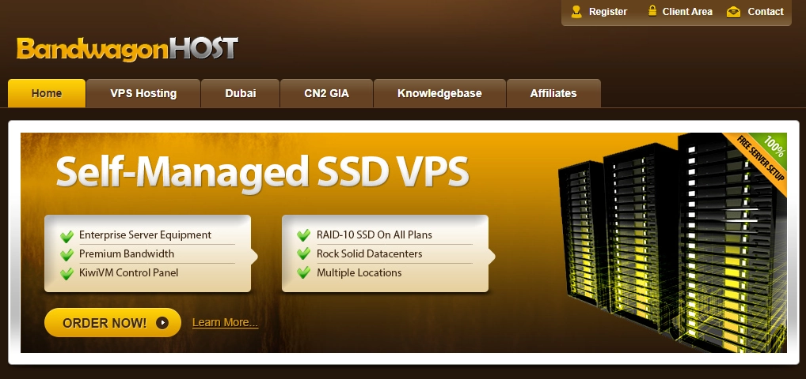

# Why Everyone Recommends BandwagonHost

---

BandwagonHost has become a go-to choice for developers and tech enthusiasts who need reliable VPS services with excellent connectivity to mainland China. The secret? Their CN2 network routes offer some of the fastest speeds available for cross-border connections, combined with pricing that won't break the bank. If you've ever purchased proxy nodes or VPN services, chances are at least one of them runs on BandwagonHost infrastructure—that's how popular it's become among service providers.

---

BandwagonHost is a company that really gets the Chinese consumer market. What draws users in isn't some marketing gimmick—it's the actual performance. Their US-based CN2 routes deliver incredibly fast connections to mainland China, which matters a lot if you're building anything that needs to communicate across that distance.

The combination of affordable pricing and solid speed is what makes this service stand out. It's practically designed for developers building proxy services or network tools. Take a look at any collection of v2ray nodes you've purchased—there's almost certainly at least one running on BandwagonHost VPS. That's not a coincidence.

Sure, there are cheaper options out there. Plenty of them, actually. But when you test them side by side with BandwagonHost, the performance difference becomes obvious pretty quickly. The company has made several smart moves to make life easier for Chinese developers. They've set up multiple domain names to ensure mainland users can access their services without hassle. They're among the few foreign providers that accept Alipay payments. And they were the first to integrate one-click VPN and Shadowsocks setup directly into their control panel—a feature so useful, it's surprising no one else has properly copied it yet.

Their anti-abuse systems are thorough too. They've built comprehensive detection mechanisms to identify problematic IPs, and ping.pe remains one of the most accurate tools for checking whether an IP has been blocked by the Great Firewall. If your IP does get blacklisted, they offer a paid IP replacement service that's completely automated—no waiting around for support tickets.

The network routes tell the story. BandwagonHost offers optimization specifically for mainland China traffic: Asia-optimized routes, CN2 GT, CN2 GIA, and Hong Kong routes. These aren't just marketing terms—they represent real infrastructure differences that affect your connection quality.

Looking at pure numbers, their entry-level plans start around $49.99/year for CN2 and KVM packages. That works out to roughly 350 RMB annually. For hosting a website plus running v2ray, it's genuinely hard to beat that value proposition.

If you're serious about quality, though, their **Los Angeles CN2 GIA route** deserves attention. This plan offers CN2 GIA routing for both China Telecom and China Unicom traffic in both directions. China Mobile gets direct routing outbound and CN2 GIA for return traffic. The bandwidth? 1Gbps. For a CN2 GIA connection, that's basically unheard of elsewhere. Test IPv4 address: `173.242.115.254`

👉 [Looking for VPS with guaranteed stable connections to mainland China? Check out these CN2 GIA optimized plans](https://bandwagonhost.com/aff.php?aff=79616)

Their **Hong Kong CN2 route** takes a different approach. China Telecom traffic goes through CN2 GIA, while China Unicom and China Mobile use standard direct connections. For some use cases, this mixed approach actually works better. Test IPv4 address: `93.179.124.1`

The specs are straightforward: 1GB memory equals 1024MB, 1TB traffic equals 1000GB, and all storage is SSD. No spinning rust here. These numbers got updated as of January 2023, and they've marked which plans support migration between data centers—a useful feature if you need to optimize for different geographic regions later.

---

BandwagonHost's popularity isn't accidental. It comes from consistent performance where it matters: fast CN2 connections, transparent pricing, and features that actually solve real problems for developers. Whether you're hosting services, building network tools, or just need reliable VPS infrastructure with good mainland China connectivity, [BandwagonHost delivers without the usual headaches](https://bandwagonhost.com/aff.php?aff=79616). That's why you keep seeing it recommended—because people who use it tend to stick with it.
